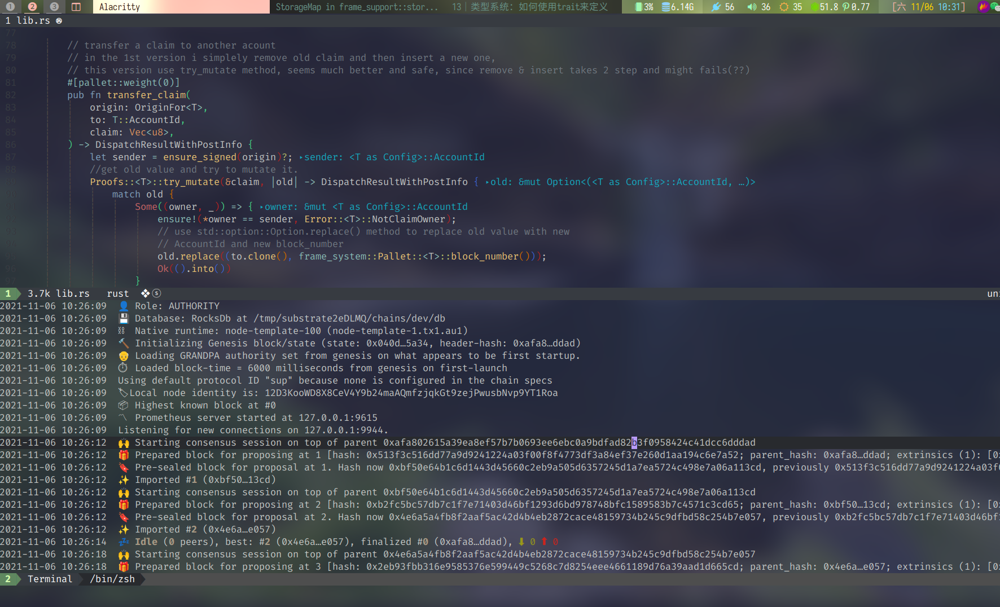
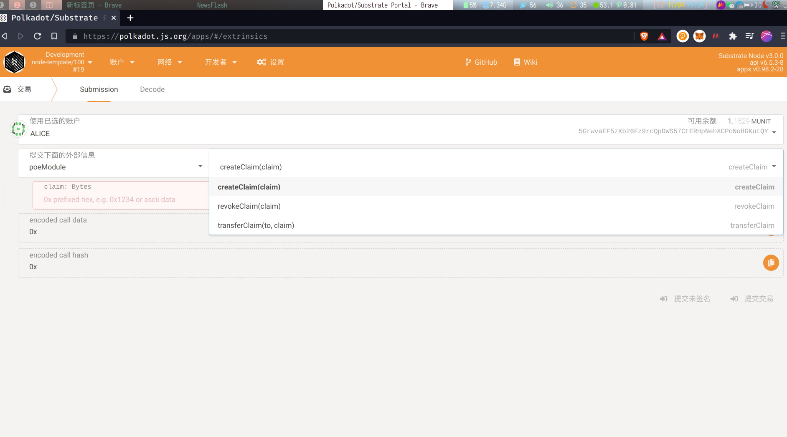
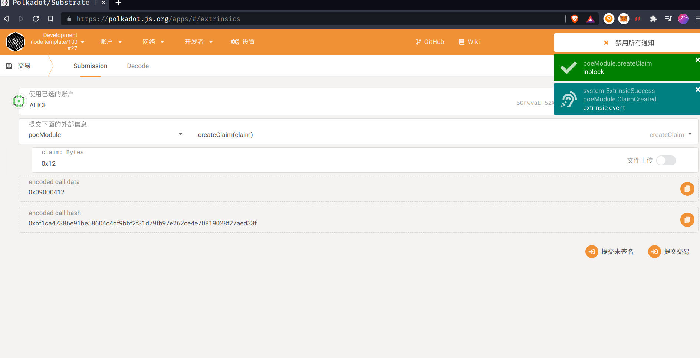
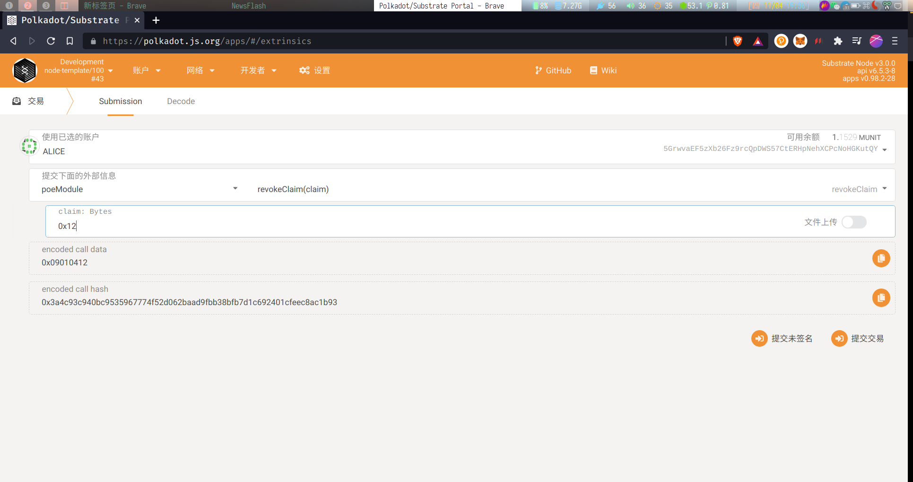
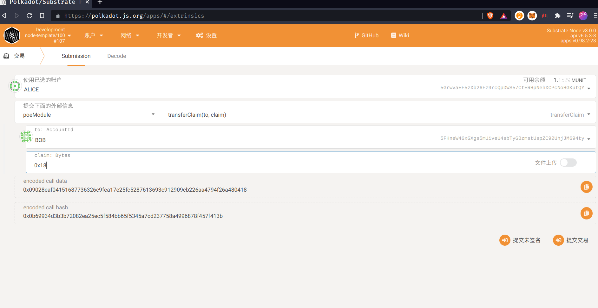
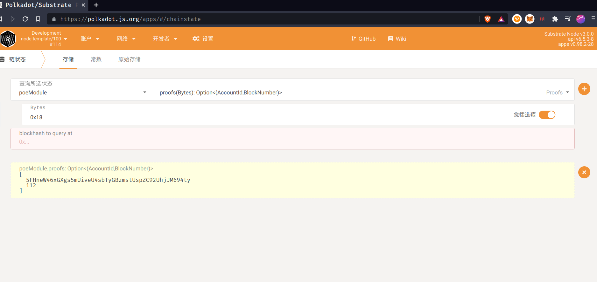

# Substrate PoE exercise

This is exercise for substrate PoE.

Phase: 7th

UID: 054

Team:  #3

Name:  Aaron 彭亚伦

The source code of PoE pallet located in fold `pallets/poe`

## Features & Screenshots

### Node running

### Features:

### Create a PoE clam

### Revoke a PoE Claim

### Transfer a PoE claim to another account

###  PoE Claim transfered

